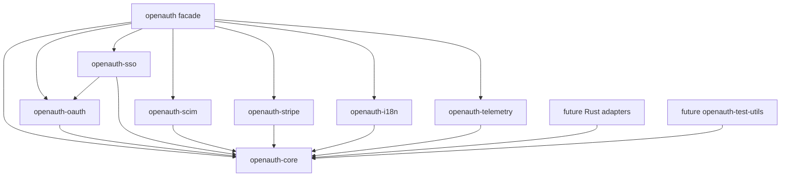

# Better Auth Porting Roadmap Implementation Plan

> **For agentic workers:** REQUIRED SUB-SKILL: Use superpowers:subagent-driven-development (recommended) or superpowers:executing-plans to implement this plan task-by-task. Steps use checkbox (`- [ ]`) syntax for tracking.

**Goal:** Port the relevant Better Auth 1.6.9 runtime, core identity plugins, SSO, SCIM, Stripe, i18n, and telemetry into the Rust OpenAuth workspace with behavior parity where it matters.

**Architecture:** `openauth-core` owns runtime contracts, DB traits, endpoint pipeline, errors, crypto, cookies, context, and base models. `openauth` is the public facade. Feature crates such as `openauth-sso`, `openauth-scim`, `openauth-oauth`, `openauth-stripe`, `openauth-i18n`, and `openauth-telemetry` depend upward on core, not sideways on each other unless a dependency is part of the Better Auth contract.

**Tech Stack:** Rust 2021 workspace, async traits for storage/runtime boundaries, typed errors, serde-compatible model contracts, Better Auth upstream snapshot at `upstream/better-auth/1.6.9`.

---

## Provenance

This roadmap is based on the local upstream snapshot:

- Source package: `upstream/better-auth/1.6.9/repository`
- NPM package: `upstream/better-auth/1.6.9/package`
- Version: `better-auth@1.6.9`
- Rust workspace: `Cargo.toml`
- Current local state: all OpenAuth crates are scaffolds exposing only `VERSION`

The upstream modules that matter most for this port are:

- `packages/core/src`: core types, API endpoint helpers, DB adapter contracts, context, OAuth2 helpers, errors, instrumentation
- `packages/better-auth/src`: main auth runtime, DB internal adapter, cookies, crypto, API routes, plugin runtime
- `packages/sso/src`: enterprise SSO, OIDC, SAML, provider management, domain verification, org assignment
- `packages/scim/src`: SCIM token management, filters, resources, PATCH operations, SCIM metadata and user endpoints
- `packages/stripe/src`: Stripe plugin routes, schema, middleware, hooks, subscription/customer logic
- `packages/i18n/src` and `packages/telemetry/src`: supporting packages that map cleanly to existing Rust crates

Explicitly out of scope for this roadmap:

- JS framework clients: React, Vue, Solid, Svelte, Lynx, Expo, Electron
- JS-only adapters: Prisma, Drizzle, Kysely, Mongo adapter package internals
- Better Auth docs site, CLI UX, smoke-test fixtures, package build tooling
- TypeScript type inference parity as a goal by itself

Adapters are still in scope as Rust traits and Rust implementations. The exclusion is only for porting JS adapter packages directly.

## Current Rust Workspace

| Crate | Current state | Target responsibility |
| --- | --- | --- |
| `openauth-core` | Scaffold | Models, errors, options, endpoint contracts, DB traits, internal adapter, cookies, crypto, context, OAuth2 primitives |
| `openauth` | Scaffold | Public facade and feature-gated reexports |
| `openauth-oauth` | Scaffold | OAuth2 client helpers, generic OAuth, OIDC provider, OAuth provider flows |
| `openauth-sso` | Scaffold | Enterprise OIDC SSO, SAML SSO, provider CRUD, domain verification |
| `openauth-scim` | Scaffold | SCIM 2.0 token management, resources, filters, users, metadata |
| `openauth-stripe` | Scaffold | Stripe customer/subscription plugin and webhooks |
| `openauth-i18n` | Scaffold | Localized messages and error labels |
| `openauth-telemetry` | Scaffold | Event model and optional publisher hooks |

## Target Crate Graph



Rule: plugin crates must depend on `openauth-core` and possibly `openauth-oauth` for protocol primitives. Avoid `openauth-scim -> openauth-sso` even though upstream SCIM tests instantiate SSO; SCIM should depend on shared organization/provider contracts extracted into core.

## Upstream Dependency Shape

The important dependency chain is:

```text
auth runtime
  -> context
  -> endpoint pipeline
  -> internal adapter
  -> DB adapter trait and schemas
  -> crypto, cookies, secondary storage, verification values
  -> core routes: sign-up, sign-in, session, account, password, email verification
  -> plugin hooks and route registration
  -> enterprise packages: SSO, SCIM, Stripe
```

Core port order matters because many plugins are thin endpoint packages over the same runtime:

- `bearer` needs session cookie parsing and `Authorization: Bearer` mapping.
- `jwt` needs JOSE/JWK and session context.
- `organization` and `admin` need sessions, DB hooks, RBAC, and extra session fields.
- `generic-oauth` needs OAuth state, account linking, callback handling, and token storage.
- `oidc-provider` needs OAuth applications, access tokens, consent, PKCE, refresh tokens, and optional JWT plugin integration.
- `sso` needs OIDC discovery, OAuth callback support, SAML XML/signature/timestamp validation, provider persistence, verification store, and optional organization assignment.
- `scim` needs user/account models, organization/provider scoping, SCIM token hashing/encryption, filters, PATCH operations, and SCIM error responses.
- `stripe` needs session middleware, user and organization references, webhooks with raw body signature checks, and subscription/customer schema.

## Milestone Roadmap

### M0: Inventory, CI, And Test Harness

**Goal:** Make the workspace ready for disciplined porting.

**Files:**

- Modify: `Cargo.toml`
- Create: `tests/` or crate-local test modules as features land
- Create: `PORTING.md`
- Later create: `crates/openauth-test-utils`

- [ ] Run baseline checks:

```bash
cargo fmt --check
cargo clippy --workspace --all-targets
cargo test --workspace
```

Expected result today: workspace compiles because crates are placeholders.

- [ ] Add a port status table to every PR touching parity-sensitive behavior.
- [ ] Create test fixtures from upstream behavior, not TypeScript implementation details.
- [ ] Keep every milestone mergeable on its own.

### M1: Core Types, Errors, And Options

**Goal:** Establish the Rust contracts that all later crates depend on.

**Upstream references:**

- `packages/core/src/types/*`
- `packages/core/src/error/*`
- `packages/better-auth/src/types/*`
- `packages/better-auth/src/context/create-context.ts`

**Rust target:**

- Modify: `crates/openauth-core/src/lib.rs`
- Create: `crates/openauth-core/src/error.rs`
- Create: `crates/openauth-core/src/model.rs`
- Create: `crates/openauth-core/src/options.rs`
- Create: `crates/openauth-core/src/plugin.rs`
- Create: `crates/openauth-core/src/time.rs`

- [ ] Define `User`, `Session`, `Account`, `Verification`, `AuthOptions`, `SessionOptions`, `CookieOptions`, `ApiError`, `StatusCode`, and plugin metadata.
- [ ] Preserve Better Auth model names and field semantics even when Rust field names use snake_case.
- [ ] Add serialization tests for model wire compatibility.

Parity gates:

- User/session/account/verification fields match upstream core schemas.
- Error status and body shape can represent Better Auth `APIError`.
- No plugin crate needs to define duplicate core identity models.

### M2: Crypto And Cookie Compatibility

**Goal:** Make session, verification, OAuth state, and SCIM token storage possible.

**Upstream references:**

- `packages/better-auth/src/crypto/*`
- `packages/better-auth/src/cookies/*`
- `packages/better-auth/src/crypto/secret-rotation.test.ts`
- `packages/better-auth/src/cookies/cookies.test.ts`

**Rust target:**

- Create: `crates/openauth-core/src/crypto/`
- Create: `crates/openauth-core/src/cookie/`

- [ ] Port random id/string generation with injectable generator for tests.
- [ ] Port password hash/verify semantics.
- [ ] Port signed cookie and HMAC behavior.
- [ ] Port JWT HS256 for verification and email flows.
- [ ] Port symmetric encryption envelope and secret rotation.
- [ ] Port cookie naming, secure defaults, cross-domain options, chunking, and deletion.

Parity gates:

- Existing Better Auth signed cookie fixtures can be parsed or explicitly documented as intentionally incompatible.
- Secret rotation tests cover current and previous secrets.
- Cookie chunking handles oversized session data.

### M3: DB Adapter Traits, Schema, Hooks, And Internal Adapter

**Goal:** Create the storage layer that core routes and plugins share.

**Upstream references:**

- `packages/core/src/db/adapter/*`
- `packages/core/src/db/schema/*`
- `packages/better-auth/src/db/internal-adapter.ts`
- `packages/better-auth/src/db/with-hooks.ts`
- `packages/better-auth/src/db/verification-token-storage.ts`
- `packages/better-auth/src/db/internal-adapter.test.ts`
- `packages/better-auth/src/db/secondary-storage.test.ts`

**Rust target:**

- Create: `crates/openauth-core/src/db/`
- Create: `crates/openauth-core/src/storage/`
- Later create: `crates/openauth-memory-adapter`

- [ ] Define `DbAdapter` CRUD trait with typed filters, ordering, pagination, and transaction boundary.
- [ ] Define schema metadata for core tables and plugin-added tables.
- [ ] Implement input/output field filtering and default values.
- [ ] Implement DB hooks with before/after phases.
- [ ] Implement `InternalAdapter` for users, sessions, accounts, and verification values.
- [ ] Implement secondary storage TTL behavior for sessions and verification cache.

Parity gates:

- Session creation, lookup, update, revoke, list, and cache behavior match upstream.
- Verification identifiers support hash/encrypt/plain storage modes.
- Hook ordering is covered by tests.

### M4: Context And Endpoint Pipeline

**Goal:** Provide the runtime surface that Better Auth plugins expect.

**Upstream references:**

- `packages/core/src/api/index.ts`
- `packages/core/src/context/*`
- `packages/better-auth/src/api/index.ts`
- `packages/better-auth/src/api/to-auth-endpoints.ts`
- `packages/better-auth/src/api/middlewares/origin-check.ts`
- `packages/better-auth/src/api/rate-limiter/index.ts`
- `packages/better-auth/src/context/*`

**Rust target:**

- Create: `crates/openauth-core/src/api/`
- Create: `crates/openauth-core/src/context/`
- Create: `crates/openauth-core/src/rate_limit.rs`

- [ ] Implement endpoint definition with method, path, body/query schemas, metadata, and handler.
- [ ] Implement middleware phases: global `onRequest`, route middleware, after hooks, and error conversion.
- [ ] Implement direct API calls for tests and server integration.
- [ ] Implement trusted origin checks, Fetch Metadata checks, form CSRF checks, and disabled paths.
- [ ] Implement rate limiting hooks over adapter or secondary storage.

Parity gates:

- `to-auth-endpoints` behavior is represented in Rust routing.
- Origin-check tests cover same-site, cross-site, missing headers, trusted origins, and disabled checks.
- Plugin route conflicts are detected before runtime.

### M5: Minimal Auth Runtime

**Goal:** Ship the first useful OpenAuth runtime: email/password auth and session management.

**Upstream references:**

- `packages/better-auth/src/auth/minimal.ts`
- `packages/better-auth/src/auth/base.ts`
- `packages/better-auth/src/api/routes/sign-up.ts`
- `packages/better-auth/src/api/routes/sign-in.ts`
- `packages/better-auth/src/api/routes/sign-out.ts`
- `packages/better-auth/src/api/routes/session.ts`
- `packages/better-auth/src/api/routes/update-session.ts`
- `packages/better-auth/src/api/routes/update-user.ts`
- `packages/better-auth/src/api/routes/password.ts`
- `packages/better-auth/src/api/routes/email-verification.ts`

**Rust target:**

- Modify: `crates/openauth/src/lib.rs`
- Create: `crates/openauth-core/src/auth/`
- Create: `crates/openauth-core/src/routes/`

- [ ] Implement builder equivalent to `betterAuth` for Rust.
- [ ] Implement sign-up email/password.
- [ ] Implement sign-in email/password with anti-enumeration behavior.
- [ ] Implement get-session, session refresh, sign-out, revoke sessions.
- [ ] Implement update-session and update-user.
- [ ] Implement password reset and email verification.
- [ ] Add examples for minimal auth with memory adapter.

Parity gates:

- Upstream route tests have Rust equivalents for success and failure cases.
- Session cookies and refresh windows match configured `expiresIn` and `updateAge`.
- Email verification and password reset use verification values safely.

### M6: Account, OAuth State, Generic OAuth, Bearer, And JWT

**Goal:** Unlock social sign-in, bearer sessions, and signed-token flows.

**Upstream references:**

- `packages/better-auth/src/api/routes/account.ts`
- `packages/better-auth/src/api/routes/callback.ts`
- `packages/better-auth/src/oauth2/*`
- `packages/better-auth/src/plugins/generic-oauth/*`
- `packages/better-auth/src/plugins/bearer/index.ts`
- `packages/better-auth/src/plugins/jwt/*`

**Rust target:**

- Modify: `crates/openauth-core/src/oauth2/`
- Modify: `crates/openauth-oauth/src/lib.rs`
- Create: `crates/openauth-oauth/src/generic.rs`
- Create: `crates/openauth-oauth/src/jwt.rs`
- Create: `crates/openauth-core/src/plugins/bearer.rs`

- [ ] Implement OAuth state generation, storage, parsing, and callback validation.
- [ ] Implement account link/unlink and access-token refresh flows.
- [ ] Implement generic OAuth provider configuration and callback.
- [ ] Implement bearer token middleware using the session token contract.
- [ ] Implement JWKS, JWT signing, verification, and key rotation.

Parity gates:

- `generic-oauth.test.ts`, `bearer.test.ts`, `jwt.test.ts`, and `rotation.test.ts` are mirrored.
- Account linking respects trusted providers and prevents unsafe linking.
- JWT key rotation has tests for active, expired, and historical keys.

### M7: Access, Admin, And Organization

**Goal:** Build the shared enterprise identity layer used by SSO, SCIM, and Stripe organization billing.

**Upstream references:**

- `packages/better-auth/src/plugins/access/*`
- `packages/better-auth/src/plugins/admin/*`
- `packages/better-auth/src/plugins/organization/*`
- `packages/better-auth/src/plugins/organization/routes/*`

**Rust target:**

- Create: `crates/openauth-core/src/access/`
- Create: `crates/openauth-core/src/admin/`
- Create: `crates/openauth-core/src/organization/`

- [ ] Implement RBAC statements, roles, permissions, and permission checks.
- [ ] Implement admin routes for users, roles, bans, impersonation, password setting, session revocation, and permission checks.
- [ ] Implement organization, member, invite, team, and active organization/session fields.
- [ ] Implement optional dynamic access control and team behavior behind Rust features.

Parity gates:

- `admin.test.ts`, `organization.test.ts`, `team.test.ts`, and `crud-*.test.ts` are represented.
- Session fields `activeOrganizationId`, `activeTeamId`, and `impersonatedBy` are typed and filterable.
- Organization hooks can be reused by SSO and Stripe.

### M8: Passwordless, 2FA, Captcha, And One-Time Tokens

**Goal:** Complete the important non-enterprise plugins that share verification storage and session hardening.

**Upstream references:**

- `packages/better-auth/src/plugins/magic-link/*`
- `packages/better-auth/src/plugins/email-otp/*`
- `packages/better-auth/src/plugins/two-factor/*`
- `packages/better-auth/src/plugins/one-time-token/*`
- `packages/better-auth/src/plugins/captcha/*`

**Rust target:**

- Create: `crates/openauth-core/src/plugins/magic_link.rs`
- Create: `crates/openauth-core/src/plugins/email_otp.rs`
- Create: `crates/openauth-core/src/plugins/two_factor/`
- Create: `crates/openauth-core/src/plugins/one_time_token.rs`
- Create: `crates/openauth-core/src/plugins/captcha.rs`

- [ ] Implement magic-link sign-in and verification.
- [ ] Implement email OTP send/check/verify/sign-in flows.
- [ ] Implement TOTP, OTP, backup codes, and two-factor verification gates.
- [ ] Implement one-time token generation and verification.
- [ ] Implement captcha `onRequest` protection and provider verification abstraction.

Parity gates:

- Verification values expire, cannot be replayed, and are scoped by identifier.
- Two-factor flows enforce fresh/sensitive session checks.
- Captcha protects the configured endpoints and passes through unprotected endpoints.

### M9: OIDC Provider And OAuth Provider

**Goal:** Support OpenAuth acting as an OAuth/OIDC server.

**Upstream references:**

- `packages/better-auth/src/plugins/oidc-provider/*`
- `packages/oauth-provider/src`

**Rust target:**

- Modify: `crates/openauth-oauth/src/lib.rs`
- Create: `crates/openauth-oauth/src/provider/`
- Create: `crates/openauth-oauth/src/oidc_provider/`

- [ ] Implement OAuth applications, access tokens, refresh tokens, consent, and PKCE.
- [ ] Implement OIDC metadata, authorize, consent, token, userinfo, dynamic registration, client management, and end-session endpoints.
- [ ] Integrate optional JWT/JWKS support from M6.

Parity gates:

- `oidc.test.ts` and `utils/prompt.test.ts` are mirrored.
- Client authentication supports Basic and `client_secret_post`.
- Refresh token rotation and consent behavior are explicit in tests.

### M10: SSO, OIDC First Then SAML

**Goal:** Port enterprise SSO without blocking on the harder SAML surface first.

**Upstream references:**

- `packages/sso/src/index.ts`
- `packages/sso/src/oidc/*`
- `packages/sso/src/routes/*`
- `packages/sso/src/saml/*`
- `packages/sso/src/linking/*`
- `packages/sso/src/saml-state.ts`

**Rust target:**

- Modify: `crates/openauth-sso/src/lib.rs`
- Create: `crates/openauth-sso/src/oidc/`
- Create: `crates/openauth-sso/src/saml/`
- Create: `crates/openauth-sso/src/routes/`
- Create: `crates/openauth-sso/src/linking/`

- [ ] Implement provider model and provider CRUD.
- [ ] Implement OIDC discovery validation and hydrated config.
- [ ] Implement `/sso/sign-in`, `/sso/callback`, and provider-specific callback routes for OIDC.
- [ ] Implement domain verification token generation and verification.
- [ ] Implement organization assignment by domain using core organization contracts.
- [ ] Implement SAML parser, assertion checks, timestamp checks, algorithm validation, ACS, and SLO.
- [ ] Implement relay state generation/parsing and replay protections.

Parity gates:

- `oidc.test.ts`, `domain-verification.test.ts`, `providers.test.ts`, and `linking/org-assignment.test.ts` are mirrored before SAML is considered complete.
- SAML must mirror `saml.test.ts`, `saml/assertions.test.ts`, and `saml/algorithms.test.ts` before production use.
- XML parsing rejects multiple assertions and unsafe signature algorithms.

### M11: SCIM 2.0

**Goal:** Port SCIM management and provisioning over the shared user, account, and organization contracts.

**Upstream references:**

- `packages/scim/src/index.ts`
- `packages/scim/src/routes.ts`
- `packages/scim/src/scim-tokens.ts`
- `packages/scim/src/scim-filters.ts`
- `packages/scim/src/patch-operations.ts`
- `packages/scim/src/scim-resources.ts`
- `packages/scim/src/user-schemas.ts`
- `packages/scim/src/scim-error.ts`

**Rust target:**

- Modify: `crates/openauth-scim/src/lib.rs`
- Create: `crates/openauth-scim/src/token.rs`
- Create: `crates/openauth-scim/src/filter.rs`
- Create: `crates/openauth-scim/src/patch.rs`
- Create: `crates/openauth-scim/src/resource.rs`
- Create: `crates/openauth-scim/src/routes.rs`
- Create: `crates/openauth-scim/src/error.rs`

- [ ] Implement SCIM token generation, hashing, encryption, verification, and revocation.
- [ ] Implement provider management endpoints.
- [ ] Implement SCIM metadata endpoints: service provider config, schemas, resource types.
- [ ] Implement `/scim/v2/Users` list/create.
- [ ] Implement `/scim/v2/Users/:userId` get/put/patch/delete.
- [ ] Implement SCIM filter parser for supported user filters.
- [ ] Implement PATCH operations for `externalId`, `userName`, and `name.*`.

Parity gates:

- `scim.test.ts`, `scim-users.test.ts`, `scim-patch.test.ts`, and `scim.management.test.ts` are mirrored.
- SCIM errors use SCIM response format, not generic OpenAuth JSON errors.
- Security-advisory cases referenced in upstream tests are preserved.

### M12: Stripe

**Goal:** Port the Better Auth Stripe plugin after the identity and organization contracts are stable.

**Upstream references:**

- `packages/stripe/src/index.ts`
- `packages/stripe/src/routes.ts`
- `packages/stripe/src/schema.ts`
- `packages/stripe/src/middleware.ts`
- `packages/stripe/src/hooks.ts`
- `packages/stripe/src/metadata.ts`
- `packages/stripe/test/*`

**Rust target:**

- Modify: `crates/openauth-stripe/src/lib.rs`
- Create: `crates/openauth-stripe/src/schema.rs`
- Create: `crates/openauth-stripe/src/routes.rs`
- Create: `crates/openauth-stripe/src/webhook.rs`
- Create: `crates/openauth-stripe/src/subscription.rs`
- Create: `crates/openauth-stripe/src/metadata.rs`

- [ ] Implement customer and subscription schema.
- [ ] Implement webhook raw-body signature verification and event dispatch.
- [ ] Implement user subscription upgrade, cancel, restore, list, success, and billing portal flows.
- [ ] Implement organization subscription and seat-based billing after organization parity.
- [ ] Implement metadata guards so Stripe objects created by OpenAuth can be recognized safely.

Parity gates:

- `stripe.test.ts`, `stripe-organization.test.ts`, `seat-based-billing.test.ts`, `metadata.test.ts`, and `utils.test.ts` are mirrored.
- Webhook tests use raw body bytes, not JSON reserialization.
- Organization billing waits for M7 organization parity.

### M13: i18n And Telemetry

**Goal:** Fill support crates once the runtime emits stable event and error contracts.

**Upstream references:**

- `packages/i18n/src`
- `packages/telemetry/src`
- `packages/core/src/instrumentation/*`

**Rust target:**

- Modify: `crates/openauth-i18n/src/lib.rs`
- Modify: `crates/openauth-telemetry/src/lib.rs`

- [ ] Implement locale catalogs for core runtime errors.
- [ ] Implement stable message keys rather than hard-coding English messages in plugins.
- [ ] Implement telemetry event model with opt-in publisher.
- [ ] Wire telemetry into context creation and selected auth/plugin events.

Parity gates:

- Error message keys are stable across crates.
- Telemetry can be disabled completely.
- Telemetry tests do not require network access.

### M14: Facade, Features, Docs, And Examples

**Goal:** Make `openauth` the ergonomic entrypoint.

**Upstream references:**

- `packages/better-auth/src/index.ts`
- `packages/better-auth/src/auth/full.ts`
- `packages/better-auth/src/plugins/index.ts`

**Rust target:**

- Modify: `crates/openauth/src/lib.rs`
- Modify: `crates/openauth/Cargo.toml`
- Modify: root `README.md`
- Create: `examples/`

- [ ] Add feature-gated reexports for core and plugin crates.
- [ ] Add examples for minimal auth, OAuth, organization, SSO OIDC, SCIM, and Stripe.
- [ ] Document unsupported JS/TS surfaces clearly.
- [ ] Add migration notes from Better Auth concepts to OpenAuth Rust concepts.

Parity gates:

- Users can build an auth server from `openauth` without importing every internal crate.
- Feature flags do not pull SAML, Stripe, or telemetry unless requested.
- `cargo doc --workspace --no-deps` succeeds.

## Package Mapping

| Upstream path | Rust target | Priority | Notes |
| --- | --- | --- | --- |
| `packages/core/src/types` | `openauth-core::{model,options,plugin}` | P0 | Base contracts for every crate |
| `packages/core/src/error` | `openauth-core::error` | P0 | Needed before endpoint parity |
| `packages/core/src/api` | `openauth-core::api` | P0 | Endpoint and middleware contract |
| `packages/core/src/db` | `openauth-core::db` | P0 | Adapter trait and schema metadata |
| `packages/better-auth/src/crypto` | `openauth-core::crypto` | P0 | Security-sensitive |
| `packages/better-auth/src/cookies` | `openauth-core::cookie` | P0 | Session parity blocker |
| `packages/better-auth/src/db/internal-adapter.ts` | `openauth-core::db::internal` | P0 | Central storage behavior |
| `packages/better-auth/src/context` | `openauth-core::context` | P0 | Runtime assembly |
| `packages/better-auth/src/api/routes` | `openauth-core::routes` | P0 | Minimal runtime |
| `packages/better-auth/src/plugins/access` | `openauth-core::access` | P1 | Required by admin/org |
| `packages/better-auth/src/plugins/admin` | `openauth-core::admin` | P1 | Enterprise support |
| `packages/better-auth/src/plugins/organization` | `openauth-core::organization` | P1 | Required by SSO/SCIM/Stripe org flows |
| `packages/better-auth/src/plugins/bearer` | `openauth-core::plugins::bearer` | P1 | Small session middleware |
| `packages/better-auth/src/plugins/jwt` | `openauth-oauth::jwt` | P1 | Shared with OIDC provider |
| `packages/better-auth/src/plugins/generic-oauth` | `openauth-oauth::generic` | P1 | Social/OAuth sign-in |
| `packages/better-auth/src/plugins/oidc-provider` | `openauth-oauth::oidc_provider` | P2 | Requires OAuth DB models |
| `packages/sso/src` | `openauth-sso` | P2 | OIDC first, SAML second |
| `packages/scim/src` | `openauth-scim` | P2 | Requires org/provider and token support |
| `packages/stripe/src` | `openauth-stripe` | P3 | Requires stable sessions/org contracts |
| `packages/i18n/src` | `openauth-i18n` | P3 | After stable message keys |
| `packages/telemetry/src` | `openauth-telemetry` | P3 | After stable event contracts |

## Porting Rules

- Prefer Rust-native APIs over TypeScript-shaped APIs when behavior stays equivalent.
- Preserve wire contracts for HTTP paths, status codes, response bodies, cookie names, cookie security behavior, model fields, token lifetimes, and security checks.
- Do not port JS framework clients, JS build tooling, Prisma, Drizzle, or Kysely internals.
- Keep cryptography boring: use audited Rust crates and add fixture tests for every format.
- Avoid plugin cycles. Shared types move down to `openauth-core`.
- Every plugin route gets unit tests for handler logic and integration tests through the endpoint pipeline.
- Every security-sensitive upstream regression test gets a Rust equivalent before marking parity complete.

## High-Risk Parity Areas

- Signed cookie format and `Set-Cookie` details
- Session cache formats: compact, JWT, JWE, chunked data
- Secret rotation for cookies, JWT, encrypted state, and SCIM tokens
- Date/time serialization and rehydration
- Secondary storage TTL behavior vs database-backed sessions
- `storeSessionInDatabase` and `preserveSessionInDatabase`
- Dynamic base URL and proxy headers
- Fetch Metadata, origin checks, and form CSRF
- DB hook ordering and transaction boundaries
- Anti-enumeration behavior in sign-in, sign-up, password reset, and change email
- Field filtering for hidden or input-disabled fields
- OAuth state in cookie vs verification storage
- SAML XML parsing, assertion count, signature algorithm validation, timestamp skew, and replay protection
- SCIM filter and PATCH edge cases
- Stripe webhook raw body signature validation

## Upstream Tests To Mirror

Core:

- `packages/better-auth/src/auth/full.test.ts`
- `packages/better-auth/src/auth/minimal.test.ts`
- `packages/better-auth/src/context/create-context.test.ts`
- `packages/better-auth/src/context/init.test.ts`
- `packages/better-auth/src/context/init-minimal.test.ts`
- `packages/better-auth/src/api/to-auth-endpoints.test.ts`
- `packages/better-auth/src/api/middlewares/origin-check.test.ts`
- `packages/better-auth/src/api/routes/session-api.test.ts`
- `packages/better-auth/src/api/routes/sign-in.test.ts`
- `packages/better-auth/src/api/routes/sign-up.test.ts`
- `packages/better-auth/src/api/routes/sign-out.test.ts`
- `packages/better-auth/src/api/routes/update-user.test.ts`
- `packages/better-auth/src/api/routes/password.test.ts`
- `packages/better-auth/src/api/routes/email-verification.test.ts`
- `packages/better-auth/src/api/routes/account.test.ts`
- `packages/better-auth/src/db/internal-adapter.test.ts`
- `packages/better-auth/src/db/secondary-storage.test.ts`
- `packages/better-auth/src/cookies/cookies.test.ts`
- `packages/better-auth/src/crypto/password.test.ts`
- `packages/better-auth/src/crypto/secret-rotation.test.ts`

Plugins and packages:

- `packages/better-auth/src/plugins/admin/admin.test.ts`
- `packages/better-auth/src/plugins/organization/organization.test.ts`
- `packages/better-auth/src/plugins/organization/team.test.ts`
- `packages/better-auth/src/plugins/organization/routes/crud-*.test.ts`
- `packages/better-auth/src/plugins/generic-oauth/generic-oauth.test.ts`
- `packages/better-auth/src/plugins/bearer/bearer.test.ts`
- `packages/better-auth/src/plugins/jwt/jwt.test.ts`
- `packages/better-auth/src/plugins/jwt/rotation.test.ts`
- `packages/better-auth/src/plugins/oidc-provider/oidc.test.ts`
- `packages/better-auth/src/plugins/oidc-provider/utils/prompt.test.ts`
- `packages/better-auth/src/plugins/magic-link/magic-link.test.ts`
- `packages/better-auth/src/plugins/email-otp/email-otp.test.ts`
- `packages/better-auth/src/plugins/two-factor/two-factor.test.ts`
- `packages/better-auth/src/plugins/one-time-token/one-time-token.test.ts`
- `packages/better-auth/src/plugins/captcha/captcha.test.ts`
- `packages/sso/src/oidc.test.ts`
- `packages/sso/src/saml.test.ts`
- `packages/sso/src/domain-verification.test.ts`
- `packages/sso/src/providers.test.ts`
- `packages/sso/src/linking/org-assignment.test.ts`
- `packages/sso/src/saml/assertions.test.ts`
- `packages/sso/src/saml/algorithms.test.ts`
- `packages/scim/src/scim.test.ts`
- `packages/scim/src/scim-users.test.ts`
- `packages/scim/src/scim-patch.test.ts`
- `packages/scim/src/scim.management.test.ts`
- `packages/stripe/test/stripe.test.ts`
- `packages/stripe/test/stripe-organization.test.ts`
- `packages/stripe/test/seat-based-billing.test.ts`
- `packages/stripe/test/metadata.test.ts`
- `packages/stripe/test/utils.test.ts`

## Recommended Execution Order

1. M0 and M1: get contracts right.
2. M2 and M3: make token, cookie, and storage behavior trustworthy.
3. M4 and M5: ship minimal auth runtime.
4. M6 and M7: add OAuth/session tokens and enterprise organization/admin base.
5. M8: complete shared auth plugins that use verification storage.
6. M9: make OpenAuth an OAuth/OIDC provider.
7. M10: port SSO, OIDC first and SAML only after XML/signature tests are in place.
8. M11: port SCIM over the stable organization/provider contracts.
9. M12: port Stripe once user/org billing references are stable.
10. M13 and M14: finish support crates, facade, docs, and examples.

## Definition Of Done Per Milestone

- Public Rust API is documented.
- Upstream behavior is mapped to Rust tests.
- Security-sensitive behavior has fixture tests.
- `cargo fmt --check` passes.
- `cargo clippy --workspace --all-targets` passes or each remaining lint has an issue reference.
- `cargo test --workspace` passes.
- The relevant row in the package mapping can move from scaffold or partial to ported.

## First Three Commits To Make

1. `chore: add porting roadmap`
   - Add this `PORTING.md`.
   - No source behavior changes.

2. `feat(core): add base auth model contracts`
   - Implement M1 models/errors/options only.
   - Add serde tests for user/session/account/verification.

3. `feat(core): add crypto and cookie primitives`
   - Implement M2 in small modules.
   - Add fixture tests before wiring into auth routes.

