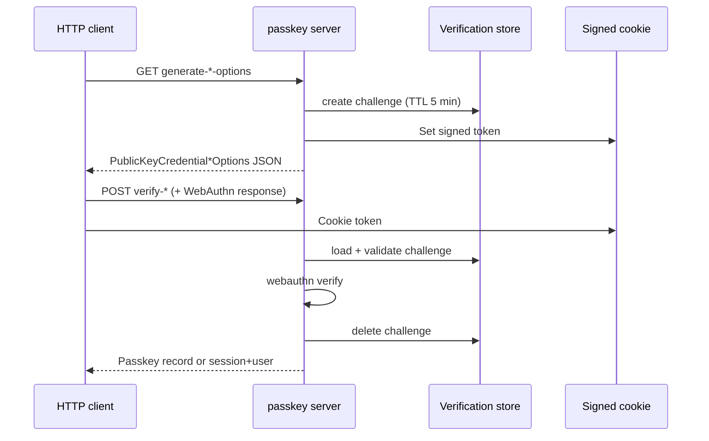

# HTTP endpoints and server behavior

All routes are relative to the auth `base_path` (e.g. `/api/auth`).

## Endpoint table

| Endpoint (internal key) | Method | Path | Upstream middleware | OpenAuth equivalent | Parity |
| --- | --- | --- | --- | --- | --- |
| `generatePasskeyRegistrationOptions` | GET | `/passkey/generate-register-options` | `freshSessionMiddleware` if `registration.requireSession` (default **true**) | Fresh session via `session_is_fresh` when `require_session` | **Aligned** |
| `generatePasskeyAuthenticationOptions` | GET | `/passkey/generate-authenticate-options` | None | No required session | **Aligned** |
| `verifyPasskeyRegistration` | POST | `/passkey/verify-registration` | `freshSessionMiddleware` if `requireSession` | Same rule on verify | **Aligned** |
| `verifyPasskeyAuthentication` | POST | `/passkey/verify-authentication` | None | None | **Aligned** |
| `listPasskeys` | GET | `/passkey/list-user-passkeys` | `sessionMiddleware` | Session required | **Aligned** |
| `deletePasskey` | POST | `/passkey/delete-passkey` | `sessionMiddleware` + `requireResourceOwnership` | Session + ownership in handler | **Aligned** (ownership failure HTTP codes differ; see § Management) |
| `updatePasskey` | POST | `/passkey/update-passkey` | `sessionMiddleware` + `requireResourceOwnership` | Session + ownership | **Aligned** |

### Query params (`generate-register-options` only)

| Param | Type | Use |
| --- | --- | --- |
| `authenticatorAttachment` | `platform` \| `cross-platform` | Authenticator selection |
| `name` | string | WebAuthn display name (`user.name`) |
| `context` | string | Passed to `resolveUser` / stored in challenge |

## Challenge flow (common)

| Aspect | Upstream | OpenAuth |
| --- | --- | --- |
| TTL | 300 s (`MAX_AGE_IN_SECONDS`) | 300 s (`CHALLENGE_MAX_AGE_SECONDS`) |
| Cookie default | `better-auth-passkey` | `better-auth-passkey` (segment; core adds prefix) |
| Store | `internalAdapter.createVerificationValue` | `create_challenge` → verification |
| Per-request expiration | Yes (fake timers test) | Yes (`*_computes_challenge_expiration_per_request`) |

## Registration

| Behavior | Upstream | OpenAuth | Notes |
| --- | --- | --- | --- |
| User with session | `session.user` email/id as name | `registration_user` from session | **Aligned** |
| No session (`requireSession: false`) | `resolveUser({ ctx, context })` | `resolve_user` + query `context` | **Aligned** |
| WebAuthn `user.id` in ceremony | Random 32-char string (not DB id) | Random user handle per ceremony | **Aligned** |
| Exclude existing credentials | Yes (`excludeCredentials`) | Yes via backend + legacy `credential_id` | **Aligned** |
| `afterVerification` → `userId` | Allows pre-auth override; validates session | `after_registration_verification`; no override when session exists | **Aligned** |
| Origin on verify | `options.origin` **or** `Origin` header | Config `origin[]` **or** header **or** `base_url` on generate | **Aligned** (OpenAuth documents more combinations) |
| Duplicate `credentialID` | Error on create | `PREVIOUSLY_REGISTERED` + unique index | **Extension** DB unique |
| `requireUserVerification` on verify | `false` (SimpleWebAuthn) | UV policy consistent register↔verify (OPE-48) | **Design** hardening |
| Verify response | Passkey object | Passkey JSON camelCase + `credentialID` | **Aligned** |

## Authentication

| Behavior | Upstream | OpenAuth | Notes |
| --- | --- | --- | --- |
| No session on generate | No `allowCredentials` (discoverable) | Missing / empty `allowCredentials` | **Aligned** |
| Session on generate | `allowCredentials` from user passkeys | List from `PasskeyStore` + legacy ids | **Aligned** |
| Lookup on verify | By `response.id` → `credentialID` | `find_by_credential_id` | **Aligned** |
| Update counter | `adapter.update` counter | `update_after_authentication` | **Aligned** |
| Create session + cookie | `createSession` + `setSessionCookie` | `create_session_for_user` + core cookies | **Aligned** |
| `afterVerification` auth | Optional hook | Async/sync callback | **Aligned** |
| Credential for verify | Rebuild from `publicKey` + counter + transports | **Full `webauthn_credential` JSON** | **Design** |
| Session challenge vs passkey | Does not validate `userData.id` vs passkey on verify | If challenge stored session user, **rejects** other user’s credential | **Design** (stricter) |
| User deleted after auth | `INTERNAL_SERVER_ERROR` "User not found" | **500** "User not found" | **Aligned** |
| Register verify crypto failure (catch) | `500` `FAILED_TO_VERIFY_REGISTRATION` | **500** same code | **Aligned** |
| Session IP | — | Core resolver, not raw `X-Forwarded-For` | **Extension** |

## Management

| Operation | Upstream | OpenAuth |
| --- | --- | --- |
| List | Array for `session.user.id` | Same |
| Update | `name` only | `name` only |
| Delete | By `id` with ownership | Same |
| Missing passkey (delete) | `APIError` | `404` + `PASSKEY_NOT_FOUND` | **Aligned** observable |
| Other user’s passkey (update) | `YOU_ARE_NOT_ALLOWED_TO_REGISTER_THIS_PASSKEY` | Same code on update | **Aligned** (GHSA-4vcf-q4xf-f48m) |
| Other user’s passkey (delete) | `UNAUTHORIZED` | `UNAUTHORIZED` | **Aligned** |

## OpenAPI / metadata

| Aspect | Upstream | OpenAuth |
| --- | --- | --- |
| operationId on routes | Yes (inline metadata) | Yes (`openapi.rs` + handlers) |
| Dedicated schema tests | No | `passkey_endpoints_expose_openapi_and_body_schemas` | **Extension** |

## Upstream server API methods (reference only)

The TS client exposes helpers calling the same routes (`auth.api.*`, `authClient.passkey.*`). OpenAuth has no client; Rust/HTTP consumers call endpoints directly.

| Upstream server helper | Real route |
| --- | --- |
| `generatePasskeyRegistrationOptions` | GET `/passkey/generate-register-options` |
| `verifyPasskeyRegistration` | POST `/passkey/verify-registration` |
| `generatePasskeyAuthenticationOptions` | GET `/passkey/generate-authenticate-options` |
| `verifyPasskeyAuthentication` | POST `/passkey/verify-authentication` |
| `listPasskeys` | GET `/passkey/list-user-passkeys` |
| `updatePasskey` | POST `/passkey/update-passkey` |
| `deletePasskey` | POST `/passkey/delete-passkey` |

Routes **not** on the server (client hints only): `/passkey/register`, `/passkey/authenticate` as POST aliases — upstream server **does not** implement them.
