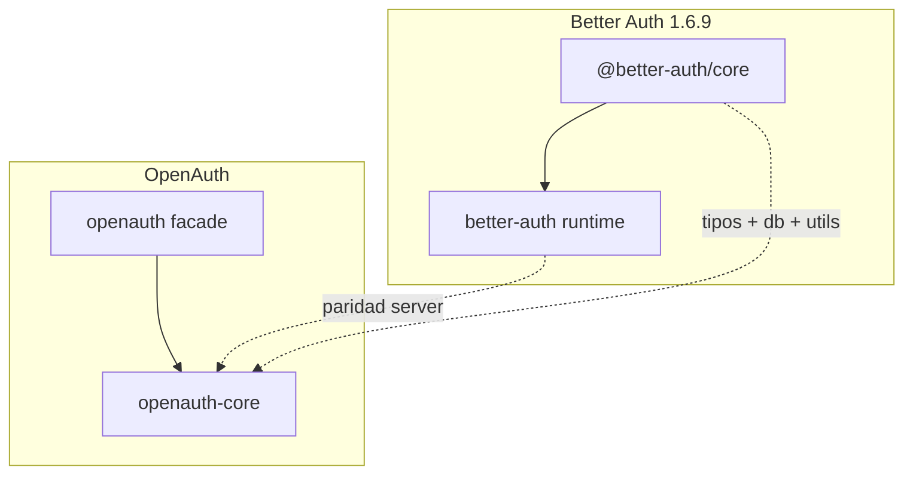

# Resumen ejecutivo — paridad `openauth-core`

## Qué estamos comparando

OpenAuth implementa el **servidor de autenticación** inspirado en Better Auth 1.6.9. Para paridad de “core”, hay que leer **dos** árboles upstream:

1. **`@better-auth/core`** — contratos, esquema, utilidades de seguridad, factories de endpoints.
2. **`packages/better-auth/src`** — runtime que ensambla rutas, cookies, crypto, adapter interno y contexto.

En Rust, **`openauth-core` fusiona ambos** en un crate. La fachada **`openauth`** solo añade `OpenAuth` / `open_auth()` y re-exports opcionales (SQLx, SSO, telemetría, etc.).

## Alcance explícito

| Incluido | Excluido (otra sesión / crate) |
| --- | --- |
| Email/password, sesión, cookies, verificación email | `sign-in/social`, `/callback/:id`, `link-social` |
| Cuentas: list, unlink (sin tokens OAuth) | `get-access-token`, `refresh-token`, `account-info` |
| Usuario: update, change-email, delete-user | Plugins npm (`admin`, `org`, `jwt`, …) |
| Rate limit, trusted origins, disabled paths | `openauth-oauth`, `openauth-social-providers` |
| Plugin contract en core (`AuthPlugin`) | Implementaciones en `openauth-plugins` |
| DB adapter trait, schema, SQL planning, memory adapter | Adapters Prisma/Drizzle/Kysely upstream |
| OpenAPI schema en router (opt-in por endpoint) | Clientes JS y bindings React/Vue |

## Estado por área (solo servidor, jun 2026)

| Área | Paridad | Notas |
| --- | --- | --- |
| Rutas HTTP core (email, sesión, password, cuenta, user) | **Alta** | Mismos paths bajo `basePath`; ver [03-routes.md](./03-routes.md) |
| Cookies + sesión en cookie | **Alta** | Chunking, firma, cache JWE (`jose`); tests extensos upstream en `cookies.test.ts` |
| Crypto (password, JWT, secret rotation) | **Alta** | Algoritmos alineados; API Rust tipada |
| DB schema + `DbAdapter` | **Alta** | Tablas user/session/account/verification/rate-limit; internal logic en Rust vs `internal-adapter.ts` |
| Context / options | **Media-alta** | Muchas opciones portadas; sin `minimal` export ni `trustedProviders` dinámico JS |
| Rate limiter | **Alta** | Memoria + secondary storage; tests dedicados |
| Plugin pipeline (core) | **Alta** | Hooks, middleware, schema merge, disabled paths |
| Utils (host, IP, URL) | **Alta** | Port directo de `@better-auth/core/utils` |
| Instrumentación OTEL | **Baja / N/A** | Upstream: `@better-auth/core/instrumentation`; OpenAuth: no spans en core |
| Telemetría producto | **Crate aparte** | `@better-auth/telemetry` → `openauth-telemetry` |
| OpenAPI | **Parcial** | Rust expone `openapi_schema()`; upstream desactiva OpenAPI en router por defecto |
| Opciones top-level (`appName`, `databaseHooks`, `onAPIError`, `hooks`) | **Huecos** | Ver [07-options-field-matrix.md](./07-options-field-matrix.md) |
| Cliente / frameworks | **N/A** | Diseño: server-only |
| `betterAuth({}).api.*` | **No** | OpenAuth: `AuthRouter` + handlers HTTP; sin RPC cliente en proceso |

## Dónde vive la lógica (referencia rápida)

| Concern | Upstream principal | OpenAuth |
| --- | --- | --- |
| Ensamblado de rutas | `better-auth/src/api/index.ts` | `openauth-core/src/api/routes/mod.rs` |
| Router + CORS/origin | `api/index.ts`, `middlewares/origin-check.ts` | `api/router.rs`, `auth/trusted_origins.rs` |
| Handler producto | `auth/base.ts`, `auth/full.ts` | `openauth/src/auth.rs` (`OpenAuth`) |
| Contexto runtime | `context/create-context.ts` | `context/builder.rs`, `context.rs` |
| Cookies | `cookies/index.ts` | `cookies/*.rs` |
| Crypto | `crypto/*` | `crypto/*.rs` |
| DB CRUD auth | `db/internal-adapter.ts` | `db/` + `session.rs`, `user.rs`, `verification.rs` |
| Esquema tablas | `@better-auth/core/db/schema` | `db/schema/` |
| Endpoint factory | `@better-auth/core/api` | `api/endpoint.rs`, `plugin_pipeline.rs` |

## Hallazgos de la revisión profunda (código + tests)

1. **Todas las rutas in-scope tienen al menos un test HTTP**, pero muchas solo **1** caso (`list_sessions`, `revoke_*`, `set_password`, …) frente a `session-api.test.ts` (~56 `it`) upstream.
2. El harness `tests/api/routes/mod.rs` **desactiva siempre** CSRF y origin check — la paridad de rutas no refleja producción ([08-gaps-audit.md](./08-gaps-audit.md)).
3. **Opciones sin equivalente:** `appName`, `databaseHooks` y `hooks` globales, `onAPIError`, `logger` configurable, `baseURL` dinámico, `verification.storeIdentifier`, hash/verify de password custom en options.
4. **Rate limits** referencian rutas de plugins (`/email-otp/*`, `/forget-password`) que **no existen** en `core_auth_async_endpoints`.
5. **OpenTelemetry** en core upstream no está en `openauth-core` (distinto de `openauth-telemetry`).
6. **Delete-user / change-email:** faltan hooks y `sendDeleteAccountVerification`; delete inmediato si sesión fresh ([10-user-lifecycle-gaps.md](./10-user-lifecycle-gaps.md)).
7. **Códigos de error:** no hay enum único `BASE_ERROR_CODES`; `SESSION_EXPIRED` vs `SESSION_NOT_FRESH` ([09-error-codes.md](./09-error-codes.md)).

## Próximas iteraciones sugeridas

1. Matriz test-a-test `session-api.test.ts` ↔ Rust ([08-gaps-audit.md](./08-gaps-audit.md)).
2. Tests de ruta con CSRF/origin **habilitados** (sub-harness).
3. Campos top-level faltantes o documentar como wont-fix en [06-design-decisions.md](./06-design-decisions.md).

## Documentos relacionados

- Fachada: crate `openauth` (mismo pin 1.6.9; tests de producto en `crates/openauth/tests/public_api.rs`).
- Paridad OAuth/social: pendiente en otra sesión (`openauth-oauth`, features `oauth` / `social-providers`).
