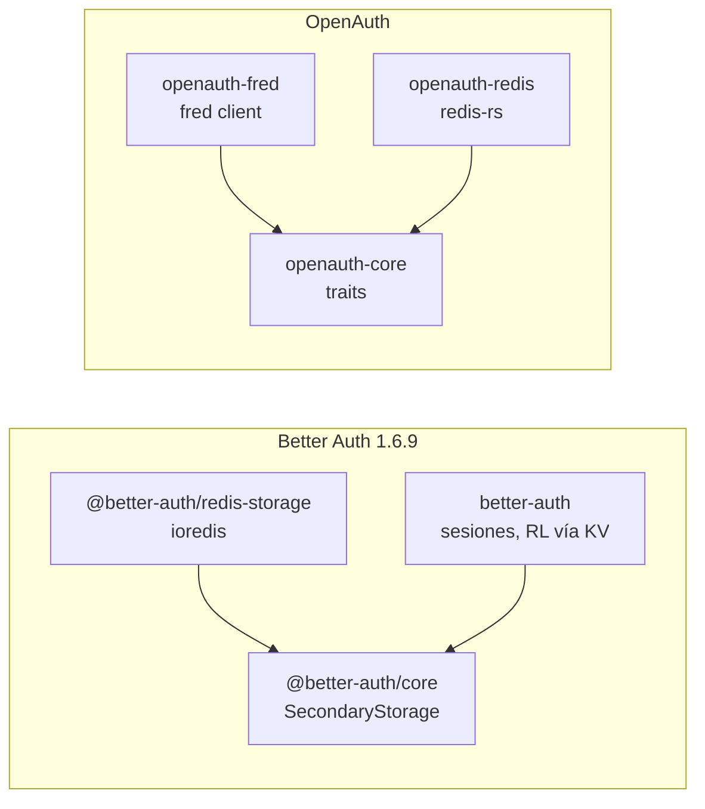

# Paridad: `openauth-fred` ↔ `@better-auth/redis-storage`

Documentación de paridad **solo servidor** entre el crate `openauth-fred` y Better Auth **v1.6.9**.

| Campo | Valor |
| --- | --- |
| Upstream npm | `@better-auth/redis-storage@1.6.9` |
| Upstream path | `reference/upstream-src/1.6.9/repository/packages/redis-storage/` |
| Crate Rust | `crates/openauth-fred` (`openauth-fred` en crates.io) |
| Crate hermano (mismo contrato, otro driver) | `crates/openauth-redis` (`redis-rs`) |
| Dependencia cliente | [`fred`](https://crates.io/crates/fred) **10.1** (no es un paquete Better Auth) |
| Paridad pin | [`reference/upstream-better-auth/VERSION.md`](../../../reference/upstream-better-auth/VERSION.md) |
| Checklist histórico | [`docs/superpowers/plans/2026-05-12-redis-storage-upstream-checklist.md`](../../superpowers/plans/2026-05-12-redis-storage-upstream-checklist.md) |
| Nota en crate | [`crates/openauth-fred/PARITY.md`](../../../crates/openauth-fred/PARITY.md) (resumen corto) |

## ¿Con qué se compara este crate?

| Pregunta | Respuesta |
| --- | --- |
| ¿Comparar `openauth-fred` con upstream? | **Sí** — es el adaptador Fred del mismo paquete npm `@better-auth/redis-storage`. |
| ¿Comparar con el crate Rust `fred` de crates.io? | **No** — `fred` es solo el driver Redis; la paridad de producto es contra Better Auth. |
| ¿Comparar con `openauth-redis`? | **Sí, como hermano** — mismo contrato OpenAuth, distinto cliente; ver [08-sibling-openauth-redis.md](./08-sibling-openauth-redis.md). |

## Relación de paquetes



| Rol | Upstream | OpenAuth (`openauth-fred`) |
| --- | --- | --- |
| Adaptador Redis secondary storage | `redisStorage({ client, keyPrefix })` | `FredSecondaryStorage` |
| Cliente Redis | `ioredis` (peer, lo crea la app) | `fred::clients::Client` vía `connect` / `new` |
| Utilidades admin | `listKeys()`, `clear()` con `KEYS` | `list_keys()`, `clear()` con `SCAN` |
| Rate limit distribuido en Redis | **No** en el paquete; core usa el mismo KV con JSON | `FredRateLimitStore` + Lua (`RateLimitStore`) |
| Tests en el paquete adaptador | **0** | **33** en este crate |
| E2E Redis real | `e2e/smoke/test/redis.spec.ts` (4 subtests) | Integración en `tests/fred_rate_limit.rs` + E2E OpenAuth |

**Empaquetado:** 1 paquete npm upstream → 2 crates Rust por **elección de driver** (`redis-rs` vs `fred`), no por dominio funcional. `openauth-fred` concentra además las utilidades `list_keys` / `clear` que `openauth-redis` aún no expone.

## Índice

| Documento | Contenido |
| --- | --- |
| [01-overview.md](./01-overview.md) | Resumen ejecutivo, alcance, % paridad |
| [02-package-mapping.md](./02-package-mapping.md) | Archivos upstream ↔ módulos Rust, API, features |
| [03-secondary-storage.md](./03-secondary-storage.md) | `get` / `set` / `delete`, TTL, `list_keys`, `clear` |
| [04-rate-limiting.md](./04-rate-limiting.md) | `FredRateLimitStore` vs rate limit upstream |
| [05-key-layout-and-fred-client.md](./05-key-layout-and-fred-client.md) | Namespaces, comandos, URL Valkey, TLS features |
| [06-consumer-integration.md](./06-consumer-integration.md) | Quién consume secondary storage (sin reimplementar core) |
| [07-tests.md](./07-tests.md) | Matriz de tests upstream ↔ `openauth-fred` |
| [08-sibling-openauth-redis.md](./08-sibling-openauth-redis.md) | Diferencias Fred vs `openauth-redis` |
| [09-audit-deep-dive.md](./09-audit-deep-dive.md) | Auditoría código/tests (fuente de verdad) |
| [10-second-pass-findings.md](./10-second-pass-findings.md) | Segunda pasada: wiring RL, core keys, cliente compartido |

## Verificación rápida

```bash
cargo fmt --all --check
cargo clippy -p openauth-fred --all-targets -- -D warnings
cargo nextest run -p openauth-fred
```

Con Redis + Valkey (docker-compose / CI):

```bash
OPENAUTH_FRED_REDIS_URL=redis://127.0.0.1:6379 \
OPENAUTH_FRED_VALKEY_URL=valkey://127.0.0.1:6380 \
cargo nextest run -p openauth-fred
```

## Estado resumido (servidor)

| Área | Paridad vs `@better-auth/redis-storage` | Notas |
| --- | --- | --- |
| Secondary storage CRUD + TTL positivo | **Alta** | Namespace `secondary:` y prefijo `openauth:` — ver [03](./03-secondary-storage.md) |
| `listKeys` / `clear` | **Alta** (comportamiento) / **Mejora** (implementación) | `SCAN` vs upstream `KEYS` |
| Rate limit Redis | **Extensión OpenAuth** | No existe en paquete upstream |
| API factory `redisStorage()` | **N/A** | Rust: `connect` / `new` — decisión idiomática |
| Tests del paquete npm | **0 upstream** | **34** en `openauth-fred` |
| E2E sesión + Redis | **Parcial** (2/4 smoke); claves core ≠ `active-sessions-*` | Sign-up, DB+sessions, password reset |
| `ttl = 0` | Upstream `SET` | Fred = upstream; **`openauth-redis` hace `DEL`** |

Última revisión: **2026-06-01** — auditoría código en [09-audit-deep-dive.md](./09-audit-deep-dive.md).
