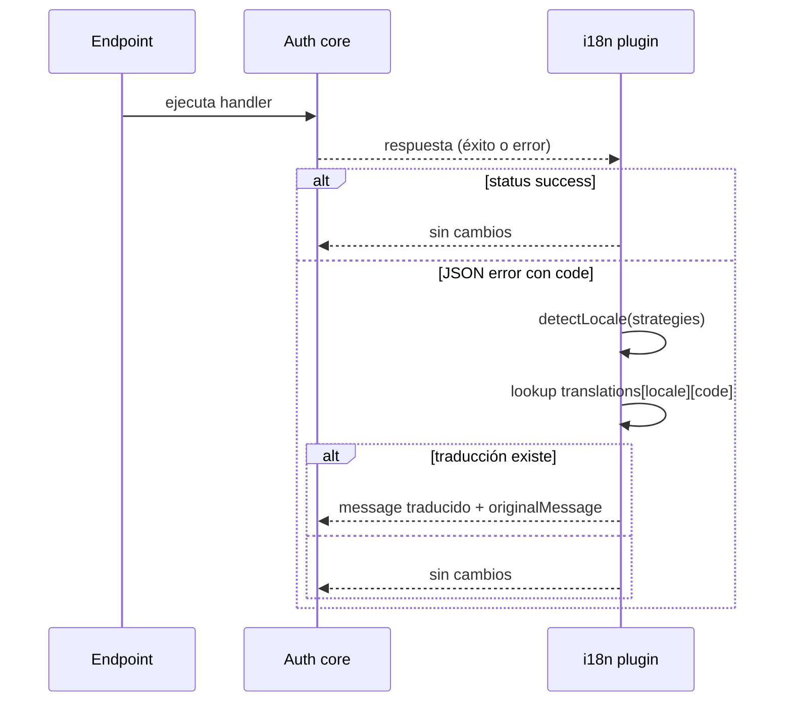

# 01 — Resumen y alcance

## Qué hace el plugin (ambos lados)

El plugin **no añade rutas**, **no toca la base de datos** y **no traduce respuestas exitosas**. Solo:

1. Detecta un locale por estrategias configurables (ordenadas).
2. Si la respuesta es un error API con `code` string y hay traducción en el diccionario del locale, sustituye `message` y añade `originalMessage` con el mensaje público previo.

Las cadenas en inglés (u otro idioma base) siguen viniendo del **core de errores**; el plugin solo aporta diccionarios adicionales por locale.

## Mapa de código

### Upstream (`packages/i18n/`)

| Archivo | Líneas (~) | Rol |
| --- | --- | --- |
| `src/index.ts` | 196 | Plugin servidor: `parseAcceptLanguage`, `detectLocale`, `hooks.after` |
| `src/types.ts` | 84 | `I18nOptions`, estrategias, `TranslationDictionary` tipado vía registry |
| `src/client.ts` | 29 | `i18nClient()` — solo inferencia de tipos |
| `src/version.ts` | 4 | `PACKAGE_VERSION` |
| `src/i18n.test.ts` | 377 | 15 casos Vitest de integración |
| `package.json` | 70 | Exports `.` y `./client` |

### OpenAuth (`crates/openauth-i18n/`)

| Archivo | Rol |
| --- | --- |
| `src/lib.rs` | Re-exports públicos, `VERSION` |
| `src/plugin.rs` | `i18n()`, detección, `AuthPlugin::on_response` |
| `src/types.rs` | `I18nOptions`, builders, `TranslationKey` |
| `src/locale.rs` | `LocaleCatalog` — normalización y match región/base |
| `src/accept_language.rs` | Parser `Accept-Language` |
| `src/cookie.rs` | Lectura de cookie vía `openauth_core::cookies` |
| `src/response.rs` | Mutación del body JSON de error |
| `src/error.rs` | `I18nConfigError` |
| `tests/i18n.rs` | Integración (espejo de `i18n.test.ts` + extras) |
| `tests/common/mod.rs` | Router/adapters de prueba |

## Alcance de esta documentación

| Incluido | Excluido |
| --- | --- |
| Plugin servidor, opciones, detección, traducción de errores | `i18nClient`, module augmentation TS |
| Tests del paquete i18n | Tests E2E de toda la app Better Auth |
| Integración vía `openauth` feature `i18n` | CLI `temp-plugins.config.ts` (scaffold) |
| Comparación con `i18n.mdx` cuando aclara comportamiento | UI strings (mencionados en README upstream pero **no implementados** en el paquete) |

## Diagrama de flujo (servidor)

**Diferencia de integración:** Better Auth intercepta en `hooks.after` sobre `ctx.context.returned` (objeto `APIError` antes de serializar). OpenAuth usa `on_response` sobre `ApiResponse` ya construida (body JSON).

## Superficie ausente (confirmada en ambos)

| Superficie | Upstream | OpenAuth |
| --- | --- | --- |
| Endpoints HTTP nuevos | No | No |
| OpenAPI routes del plugin | No | No |
| Schema / migraciones | No | No |
| Rate limits | No | No |
| Traducción en cliente | No (solo tipos) | No (crate no publicado para cliente) |
