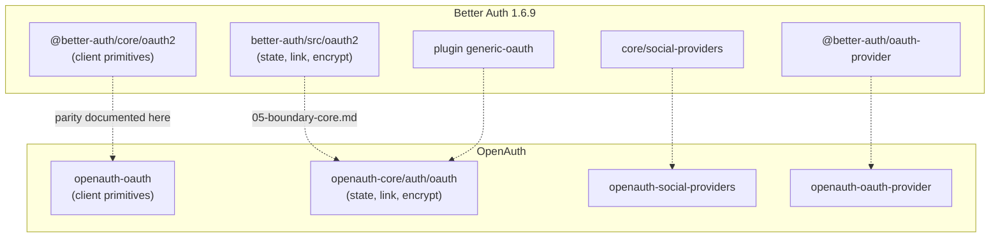

# 01 — Overview: `openauth-oauth`

## What this crate is

`openauth-oauth` implements the **OAuth 2.0 / OIDC client primitives** that Better Auth concentrates in `@better-auth/core` under `packages/core/src/oauth2/`. It is **client code toward external IdPs** (Google, GitHub, Auth0, etc.), not an authorization server.

Applications typically consume it via:

- `openauth` (re-export with feature `oauth`)
- `openauth-social-providers` (per-provider implementations)
- `openauth-core` (routes `/sign-in/social`, `/callback/:id`)

## Upstream reference

| Field | Value |
| --- | --- |
| Package | `@better-auth/core@1.6.9` |
| Directory | `packages/core/src/oauth2/` |
| Re-export | `better-auth/oauth2` → re-exports core + server layer |
| Commit pin | `f484269228b7eb8df0e2325e7d264bb8d7796311` |

## Scope of this documentation

| Included | Excluded |
| --- | --- |
| `createAuthorizationURL` ↔ `create_authorization_url` | `@better-auth/oauth-provider` (AS) → [`openauth-oauth-provider`](../openauth-oauth-provider/README.md) |
| Grants: code, refresh, client_credentials | `packages/core/src/social-providers/*` → `openauth-social-providers` |
| PKCE, token parsing, HTTP form POST | `generic-oauth` plugin (routing E2E) — shared primitives only |
| JWT/JWKS: `validateToken`, `verifyAccessToken` | `better-auth/client`, nanostores, browser SDK |
| Provider traits (`OAuthProvider`) | `oauth-proxy` plugin (not ported) |
| SSRF, error redaction (Rust-only) | Deprecated upstream OIDC provider plugin |

## Executive summary

OpenAuth treated `@better-auth/core/oauth2` as a **behavioral reference**, not a line-by-line port. The Rust crate covers the same OAuth **client functional surface** with explicit hardening decisions:

1. **High parity** on the three OAuth grants, PKCE, token parsing, JWT/JWKS verification, and remote introspection.
2. **Hardening** not present upstream: protected parameter list, SSRF on outbound HTTP, secret redaction in errors, strict JSON response validation.
3. **Package split**: the state/linking/encrypt layer that upstream mixes in `better-auth/src/oauth2/` lives in `openauth-core/src/auth/oauth/`.
4. **Tests**: upstream has **15** unit tests in `core/oauth2/`; OpenAuth has **57** verified with `cargo nextest run -p openauth-oauth` (48 integration + 2 module + 7 SSRF unit).

## Responsibility diagram

## Parity status by category

| Category | Status | Comment |
| --- | --- | --- |
| Authorization URL | ✅ High | OIDC params (`claims`, `prompt`, `hd`, …) aligned |
| Authorization code exchange | ✅ High | Includes RFC 8707 `resource`, `device_id`, `client_key` |
| Refresh token | ✅ High | Refresh token expiry (#7682 upstream) |
| Client credentials | ✅ High | Upstream Basic auth quirk documented |
| PKCE RFC 7636 | ✅ High | Rust validates verifier in builders |
| Token normalization | ✅ High | `raw` preserved; extra validation in Rust |
| `validateToken` | ✅ High | Shared JWKS cache (`get_cached_jwks_for_token`) |
| `verifyAccessToken` | ✅ High+ | No upstream unit tests; Rust 10+ tests |
| JWKS cache | ⚡ Improved | Different design (URL-keyed vs global) |
| Protected params | ⚡ Extra Rust | Upstream allows override |
| SSRF guard | ⚡ Extra Rust | Not in upstream |
| Error model | ⚡ Idiomatic Rust | `OAuthError` enum vs mixed throws |
| `AwaitableFunction` options | ⚠️ Partial | Upstream: async `options` factory; Rust: sync `ProviderOptions` |
| Provider trait async | ⚡ Idiomatic Rust | `SocialOAuthProvider` async vs sync TS |

## Out of scope (cross-references)

| Topic | Where to document |
| --- | --- |
| OAuth authorization server | [`openauth-oauth-provider`](../openauth-oauth-provider/README.md) |
| Social providers (35 IdPs) | `openauth-social-providers` (parity doc pending) |
| Enterprise SSO OIDC | [`openauth-oidc`](../openauth-oidc/README.md) |
| State + account linking | [05-boundary-core.md](./05-boundary-core.md) |
