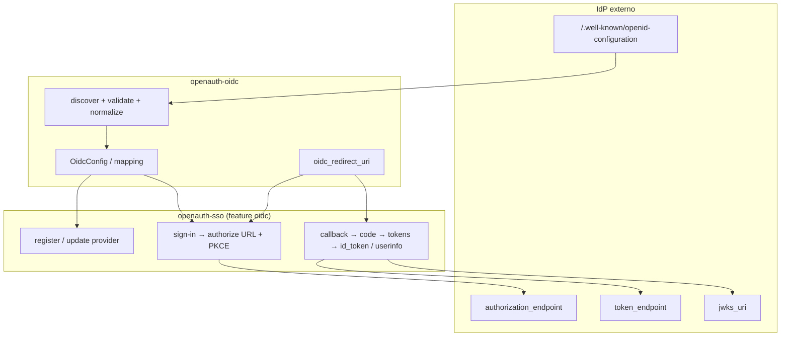

# 01 — Resumen ejecutivo

## Qué es cada lado

| | Better Auth (`@better-auth/sso` / `oidc/`) | OpenAuth (`openauth-oidc`) |
| --- | --- | --- |
| Propósito | Helpers OIDC **relying party**: discovery, normalización, hidratación de config | Mismo rol, crate publicable y sin SAML |
| Dirección | OpenAuth consume IdPs externos (Okta, Entra, Auth0, …) | Igual |
| No es | Authorization server ni plugin HTTP completo | Igual — ver `openauth-oauth-provider` y `openauth-sso` |

## Alcance de esta documentación

**Incluido (este crate)**

- Tipos `OidcConfig` / mapping / secretos.
- Pipeline discovery (fetch, validar issuer, campos requeridos, origins).
- `needs_runtime_discovery` / `ensure_runtime_oidc_config_*`.
- Construcción de `redirect_uri` (`oidc_redirect_uri`).

**Excluido (documentado en [06-boundary-sso.md](./06-boundary-sso.md))**

- Rutas `/sso/register`, `/sign-in/sso`, `/sso/callback/*`.
- Intercambio de código, PKCE en sign-in, validación JWT/`id_token`, UserInfo.
- Modelo `ssoProvider`, domain verification, SAML, `provisionUser`.
- `@better-auth/sso/client` y cualquier SDK de navegador.

**Excluido (otros productos upstream, no paridad de este crate)**

- `@better-auth/oauth-provider` — tu app como OP.
- `better-auth/plugins/generic-oauth` — OAuth ad hoc con otro prefijo de callback.
- `better-auth/plugins/oidc-provider` — OP deprecado en core.

## Mapa mental

## Conclusión en una tabla

| Categoría | Estado |
| --- | --- |
| Paridad discovery / tipos con `packages/sso/src/oidc` | **Alta (~90–95%)** en comportamiento del pipeline |
| Superset seguridad | Re-validación de origins tras merge de overrides ([07-deep-audit.md](./07-deep-audit.md)) |
| Superset persistencia registro | revoke / end_session / introspection en DB (upstream no los expone en Zod) |
| `scopes` en DB | **Alineado** con upstream (solo scopes explícitos; no auto desde discovery) |
| Tests unitarios discovery | **18** en crate vs **71** Vitest — ~45 cubiertos en crate, resto en SSO ([05-tests.md](./05-tests.md)) |
| Flujo OIDC completo | **Fuera del crate** — **22** `it` en `oidc.test.ts` → `openauth-sso` |

## Lectura recomendada

1. [02-package-mapping.md](./02-package-mapping.md) — dónde vive cada archivo.
2. [03-api-and-types.md](./03-api-and-types.md) — tabla API.
3. [05-tests.md](./05-tests.md) — qué falta cubrir solo en `openauth-oidc` vs en SSO.
