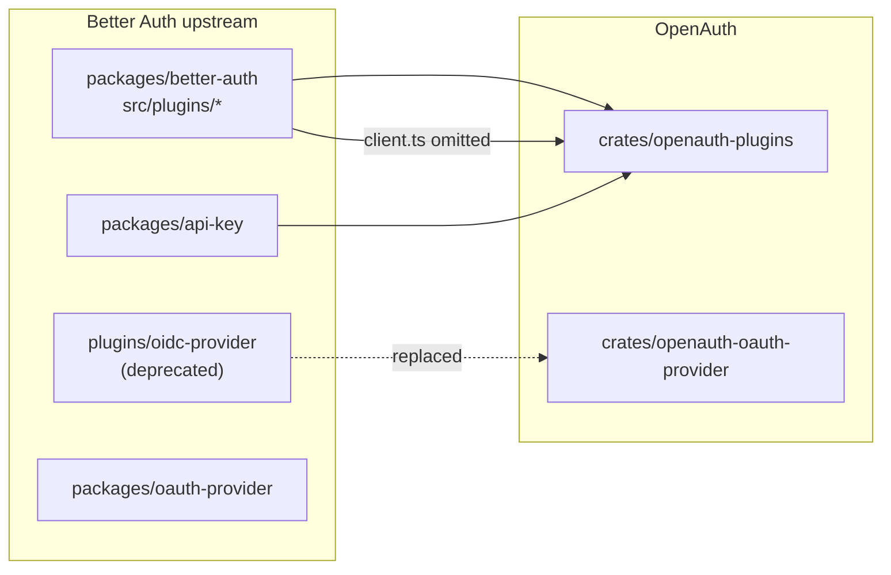

# Package mapping: upstream → `openauth-plugins`

Better Auth v1.6.9 organizes plugins differently from OpenAuth. This document explains **where each piece lives** and **why** there is no 1:1 npm folder correspondence.

## Packaging diagram

## Mapping table

| Upstream | Upstream path | OpenAuth | Notes |
|----------|---------------|----------|-------|
| `access` | `better-auth/src/plugins/access/` | `src/access/` | RBAC utility; not an `AuthPlugin` on either side |
| `additional-fields` | `better-auth/src/plugins/additional-fields/` | `src/additional_fields/` | Upstream: `client.ts` only for TS inference. OpenAuth: server schema + runtime fields |
| `admin` | `better-auth/src/plugins/admin/` | `src/admin/` | — |
| `anonymous` | `better-auth/src/plugins/anonymous/` | `src/anonymous/` | — |
| `api-key` | **`packages/api-key/`** (separate npm) | `src/api_key/` | Consolidated into plugins crate by design |
| `bearer` | `better-auth/src/plugins/bearer/` | `src/bearer/` | — |
| `captcha` | `better-auth/src/plugins/captcha/` | `src/captcha/` | — |
| `custom-session` | `better-auth/src/plugins/custom-session/` | `src/custom_session/` | — |
| `device-authorization` | `better-auth/src/plugins/device-authorization/` | `src/device_authorization/` | — |
| `email-otp` | `better-auth/src/plugins/email-otp/` | `src/email_otp/` | — |
| `generic-oauth` | `better-auth/src/plugins/generic-oauth/` | `src/generic_oauth/` | Presets under `providers/` |
| `haveibeenpwned` | `better-auth/src/plugins/haveibeenpwned/` | `src/haveibeenpwned/` | Runtime id: `have-i-been-pwned` vs upstream `haveibeenpwned` |
| `jwt` | `better-auth/src/plugins/jwt/` | `src/jwt/` | — |
| `last-login-method` | `better-auth/src/plugins/last-login-method/` | `src/last_login_method/` | — |
| `magic-link` | `better-auth/src/plugins/magic-link/` | `src/magic_link/` | — |
| `mcp` | `better-auth/src/plugins/mcp/` | `src/mcp/` | Upstream MCP client → out of server scope |
| `multi-session` | `better-auth/src/plugins/multi-session/` | `src/multi_session/` | — |
| `oauth-proxy` | `better-auth/src/plugins/oauth-proxy/` | `src/oauth_proxy/` | — |
| `oidc-provider` | `better-auth/src/plugins/oidc-provider/` | **`openauth-oauth-provider`** | Not in plugins; explicit test in `tests/plugins.rs` |
| `one-tap` | `better-auth/src/plugins/one-tap/` | `src/one_tap/` | Google One Tap client hooks → client-only |
| `one-time-token` | `better-auth/src/plugins/one-time-token/` | `src/one_time_token/` | — |
| `open-api` | `better-auth/src/plugins/open-api/` | `src/open_api/` | — |
| `organization` | `better-auth/src/plugins/organization/` | `src/organization/` | Routes under `routes/` |
| `phone-number` | `better-auth/src/plugins/phone-number/` | `src/phone_number/` | — |
| `siwe` | `better-auth/src/plugins/siwe/` | `src/siwe/` | — |
| `two-factor` | `better-auth/src/plugins/two-factor/` | `src/two_factor/` | — |
| `username` | `better-auth/src/plugins/username/` | `src/username/` | — |
| `test-utils` | `better-auth/src/plugins/test-utils/` | — | Upstream tests only; not ported |

## Plugins outside this crate

| Upstream functionality | OpenAuth crate | Reason |
|------------------------|----------------|--------|
| `oidc-provider` | `openauth-oauth-provider` | Deprecated upstream; OAuth 2.1/OIDC is its own domain |
| `sso` | `openauth-sso` | Enterprise SAML/OIDC |
| `scim` | `openauth-scim` | Provisioning |
| `passkey` | *(planned / other crate)* | WebAuthn client-heavy |
| `stripe` | — | Billing; not core server auth |
| Adapters (drizzle, prisma, …) | `openauth-sqlx`, etc. | Persistence layer |

## Naming conventions

| Upstream (kebab-case) | Rust (snake_case) | Plugin ID (HTTP) |
|-----------------------|-------------------|------------------|
| `email-otp` | `email_otp` | `email-otp` |
| `api-key` | `api_key` | `api-key` |
| `device-authorization` | `device_authorization` | `device-authorization` |

**Plugin IDs** for HTTP and registration follow upstream kebab-case (`UPSTREAM_PLUGIN_ID` in each `mod.rs`).

## Consolidation vs split

| Decision | Upstream | OpenAuth | Reason |
|----------|----------|----------|--------|
| api-key in plugins | npm `@better-auth/api-key` | `api_key` module | Single server plugins crate; unified Rust publication |
| additional-fields server | TS client only | Schema + init hook | Rust needs explicit schema for adapters/migrations |
| oidc-provider separate | Inside better-auth (legacy) | `openauth-oauth-provider` crate | Large OIDC surface; do not mix with optional plugins |
| JWT sign/verify HTTP | Server API without public path | `POST /sign-jwt`, `POST /verify-jwt` | Idiomatic Rust/Axum; explicit endpoints |

## Automatic verification

`crates/openauth-plugins/tests/plugins.rs` maintains the canonical list:

- **`supported_server_plugins()`** — 27 IDs in `PLUGIN_IDS`
- **`upstream_server_plugins()`** — 28 upstream IDs including `oidc-provider`
- **`replaced_server_plugins()`** — `("oidc-provider", "openauth-oauth-provider")`

Any new upstream plugin must appear in supported or replaced.
