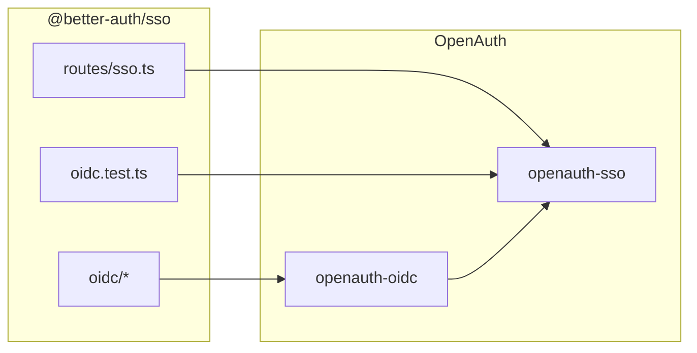

# 01 — Overview: `openauth-sso` OIDC vs Better Auth SSO

## Alcance

Este directorio documenta la paridad del **flujo HTTP OIDC** (registro de proveedor, `/sign-in/sso`, callback per-provider y shared callback, provisioning, `defaultSSO`, redirect compartido). No cubre SAML ni SCIM.

La lógica de discovery, normalización de URLs, runtime requirements y tipos `OidcConfig` viven en **`openauth-oidc`** — ver [06-boundary-sso.md](../openauth-oidc/06-boundary-sso.md).

## Arquitectura (resumen)

## Estado de paridad (OIDC E2E)

| Área | Estado | Notas |
| --- | --- | --- |
| Registro (`registerSSOProvider`) | **Alta** | `INVALID_ISSUER`, `PROVIDER_EXISTS`, discovery en registro |
| Sign-in (email / domain / providerId) | **Alta** | Incl. `defaultSSO` y runtime hydrate de `authorizationEndpoint` |
| Callback + ID token + UserInfo | **Alta** | Muchos escenarios en `oidc_callback/*`; mock `MockOidcServer` |
| Shared `redirectURI` + `/sso/callback` | **Alta** | Registro, authorize URL y callback E2E |
| `provisionUser` first vs every login | **Alta** | `oidc_callback/provisioning.rs` |
| Sign-up disabled / explicit sign-up | **Alta** | `mapping_signup.rs` |
| Email lowercase en OIDC | **Alta** | `id_token_linking.rs` / userinfo fixtures |
| Org slug sign-in | **Parcial** | Requiere plugin `organization`; escenarios montados en tests con org cuando aplica |
| `ssoClient()` | **N/A** | Solo TypeScript |

## Auditoría SSO vs `oidc.test.ts`

Segunda pasada **2026-06-01**: se añadió `tests/sso/endpoints/oidc_upstream_parity.rs` con seis tests alineados a huecos de la matriz upstream (issuer inválido, provider duplicado, sign-in por email, hydrate runtime, redirect compartido, callback compartido). El resto de los 22 escenarios upstream ya tenía cobertura repartida en `registration/`, `sign_in/`, `oidc_callback/` y `sign_in/defaults_discovery.rs` — detalle en [06-tests.md](./06-tests.md).

## Gaps cerrados recientemente

- Endpoints OIDC `""` no bloquean runtime discovery (crate + merge en `provider_update`).
- Matriz discovery: issuer trailing slash, token auth preference, HTTP/HTTPS en `normalize_absolute_http_url` — tests en `openauth-oidc`.
