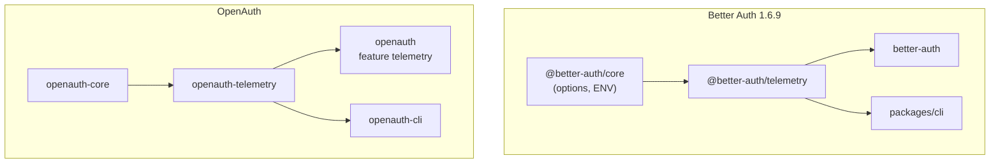

# 01 — Overview and code map

## What this package is (upstream and OpenAuth)

**Opt-in** anonymous usage telemetry: aggregated events (`init`, arbitrary CLI events, etc.) to an HTTP endpoint or a `customTrack` callback. **Not** OpenTelemetry instrumentation.

- Upstream: standalone package consumed by `better-auth` and the `auth` CLI.
- OpenAuth: `openauth-telemetry` crate consumed by `openauth` (feature `telemetry`) and `openauth-cli`.

## Documentation scope

| Included | Excluded |
| --- | --- |
| Logic in `packages/telemetry` and Rust equivalent | Client SDK, browser, React |
| Server producers (init, CLI) | `tsdown` build, ESM exports, `typesVersions` |
| Privacy-preserving option snapshots | Copying stale upstream test key names when source uses another name |
| Detectors with a reasonable Rust equivalent | Scanning `node_modules` / `package.json` unless explicitly supported |

## File map

### Upstream (`packages/telemetry/src/`)

| File | Responsibility |
| --- | --- |
| `index.ts` | “Edge” build: `createTelemetry`, detectors without Node FS |
| `node.ts` | Node build: same exports + `package.json`, `os`, Docker/WSL |
| `types.ts` | `TelemetryEvent`, `TelemetryContext`, `DetectionInfo` |
| `project-id.ts` | Globally cached anonymous ID |
| `detectors/detect-auth-config.ts` | `getTelemetryAuthConfig` |
| `detectors/detect-database.ts` | npm deps → DB name |
| `detectors/detect-framework.ts` | npm deps → JS framework |
| `detectors/detect-runtime.ts` | Deno / Bun / Node / edge + environment |
| `detectors/detect-system-info.ts` | Stub (nulls) on edge; full in `node.ts` |
| `detectors/detect-project-info.ts` | `npm_config_user_agent` → package manager |
| `utils/hash.ts`, `id.ts`, `package-json.ts` | Hash, random id, npm versions |
| `telemetry.test.ts` | 6 Vitest tests |

**Dual entry:** `package.json` exports `"."` with `node` condition → `dist/node.mjs` vs `dist/index.mjs`.

### OpenAuth (`crates/openauth-telemetry/src/`)

| File | Responsibility |
| --- | --- |
| `lib.rs` | `create_telemetry`, `TelemetryPublisher`, init wiring |
| `types.rs` | Public types + `TelemetryHttpTransport` trait |
| `auth_config.rs` | `get_telemetry_auth_config` |
| `env.rs` | `OPENAUTH_*`, CI, test |
| `project_id.rs` | ID from `Cargo.toml` + `base_url` |
| `transport.rs` | `reqwest` (`http` feature) |
| `detectors/mod.rs` | Re-exports |
| `detectors/runtime.rs` | `rust` + `detect_environment` |
| `detectors/database.rs` | Cargo deps → DB |
| `detectors/framework.rs` | Cargo deps → Rust HTTP framework |
| `detectors/package_manager.rs` | Cargo |
| `detectors/system_info.rs` | Host + vendors (no `sysinfo` dep) |
| `detectors/cargo_manifest.rs` | Shared manifest parser |
| `utils/hash.rs`, `id.rs` | Same intent as upstream |
| `tests/telemetry.rs` | Integration (parity + extensions) |

**Single logical artifact:** no `node` vs `edge` entry; the Rust host uses `Cargo.toml` and `std` where applicable.

## Dependency diagram

`openauth-core` does **not** depend on `openauth-telemetry` (avoids a cycle); context exposes `publish_telemetry` with a noop publisher by default.

## Global design decisions (Rust / server-only)

| Topic | Upstream | OpenAuth | Reason |
| --- | --- | --- | --- |
| Env prefix | `BETTER_AUTH_*` | `OPENAUTH_*` | Different project |
| Reported runtime | node / bun / deno / edge | `rust` + `RUSTC_VERSION` | Rust server |
| DB/framework detection | `package.json` / `node_modules` | `[dependencies]` in `Cargo.toml` | Rust ecosystem |
| Package manager | npm/pnpm/yarn from user-agent | `cargo` + `CARGO_VERSION` | Typical server has no npm |
| JS frameworks | next, nuxt, sveltekit, … | axum, actix-web, rocket, … | Real workspace integrations |
| Default endpoint | None (noop without URL) | Same | Explicit opt-in |
| `OPENAUTH_TELEMETRY=false` | `BETTER_AUTH_TELEMETRY=false` does not block `telemetry.enabled: true` | **Hard opt-out** overrides options | Safer operator semantics |
| Sync `build()` | N/A in TS | Does not init telemetry | `create_telemetry` is async; use `build_async()` |
| `TelemetryTestHooks` | Does not exist | Deterministic test overrides | Rust testability |
| `TelemetryHttpTransport` | Fixed `@better-fetch/fetch` | Injectable trait | Tests without network |

## Documented upstream drift (do not copy blindly)

Vitest `telemetry.test.ts` expects keys that **do not** match `detect-auth-config.ts` in v1.6.9:

| Test expects | Upstream implementation | OpenAuth |
| --- | --- | --- |
| `emailVerification.onEmailVerification` | `beforeEmailVerification` | `beforeEmailVerification` (matches source) |
| `user.changeEmail.sendChangeEmailVerification` | `sendChangeEmailConfirmation` | `sendChangeEmailConfirmation` (see §04 if core lacks callback) |
| `advanced.database.useNumberId` | Not in TS snapshot | Not emitted |
