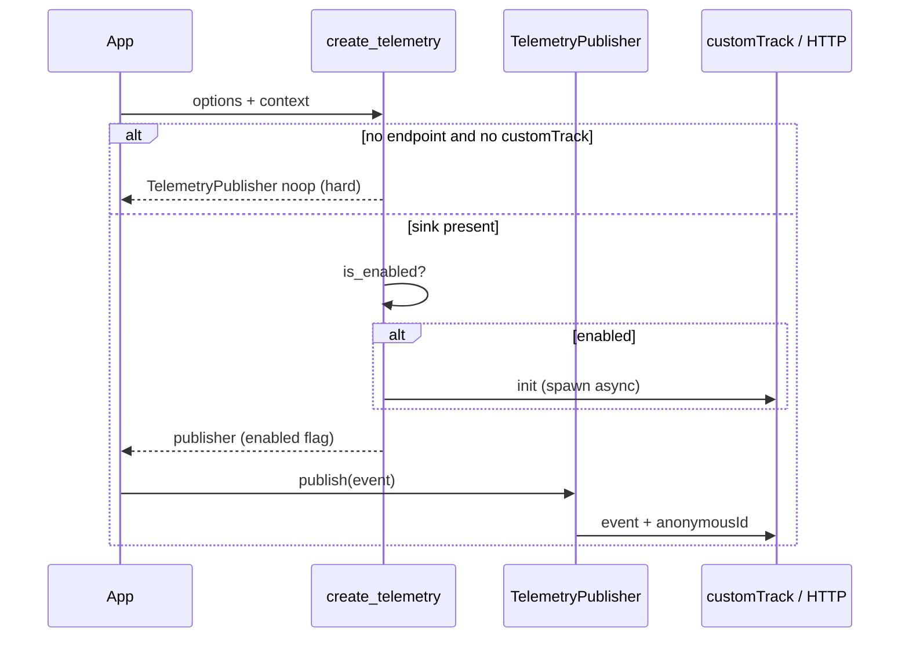

# 03 — Publisher, enablement, and transport

## `create_telemetry` / `createTelemetry` flow



## Hard noop (no sink)

| Condition | Upstream | OpenAuth |
| --- | --- | --- |
| No `BETTER_AUTH_TELEMETRY_ENDPOINT` and no `customTrack` | Immediate noop `publish` | `TelemetryPublisher::noop()` — does **not** send `init` |
| `customTrack` present but disabled | No init track call | Same: `enabled == false` → no init |

**Intent parity:** telemetry requires an explicit destination.

## Enablement logic

### Upstream (`index.ts` / `node.ts`)

```text
enabled = (getBooleanEnvVar("BETTER_AUTH_TELEMETRY", false) OR options.telemetry.enabled)
          AND (skipTestCheck OR NOT isTest())
```

`getBooleanEnvVar` with fallback `false`: unset env does not enable via env alone.

### OpenAuth (`lib.rs` + `env.rs`)

```text
if OPENAUTH_TELEMETRY in {false, 0} → disabled (ignores options.telemetry.enabled)
if OPENAUTH_TELEMETRY in {true, 1} → env forces enabled
if unset → options.telemetry.enabled (default false)
AND (skip_test_check OR NOT is_test())
```

| Scenario | Upstream | OpenAuth | Classification |
| --- | --- | --- | --- |
| `telemetry.enabled: true`, env unset | On | On | Parity |
| `telemetry.enabled: true`, env `false` | **On** (env false does not block) | **Off** | **OpenAuth decision** (operator opt-out) |
| `telemetry.enabled: false`, env `true` | On | On | Parity |
| `RUST_ENV=test` / Vitest | Off | Off | Parity (different names) |
| `skipTestCheck` | On in tests | On | Parity |

### Boolean env parsing (when read)

| Value | OpenAuth `parse_bool` | Typical upstream `getBooleanEnvVar` |
| --- | --- | --- |
| empty / unset | defer / fallback | fallback |
| `0`, `false` | false | false |
| `1`, `true`, other non-empty | true | true |

Rust tests: `telemetry_env_true_*`, `telemetry_env_zero_*`, `env_opt_out_overrides_*`, `env_opt_in_overrides_*`.

## Transport and debug

| Behavior | Upstream | OpenAuth | Parity |
| --- | --- | --- | --- |
| Priority | `customTrack` > POST | Same | Yes |
| Debug | `telemetry.debug` or `BETTER_AUTH_TELEMETRY_DEBUG` → log JSON | `TelemetryOptions.debug` or `OPENAUTH_TELEMETRY_DEBUG` → `eprintln!` | Yes |
| Custom track error | `.catch(logger.error)` | `tokio::spawn`; isolated panic in tests | Yes (non-fatal) |
| HTTP error | `.catch(logger.error)` | `let _ = post_json` | Yes (non-fatal) |
| Blocking init | `void track(init)` | `tokio::spawn` | **Rust improvement** (does not block `create_telemetry`) |

## `init` event

Payload keys (camelCase JSON):

| Key | Parity |
| --- | --- |
| `config` | Yes (see [04](./04-auth-config-snapshot.md)) |
| `runtime` | Different name (`rust` vs node/…) |
| `database` | Different mechanism, same `{name, version}` shape |
| `framework` | Same |
| `environment` | `production` \| `ci` \| `test` \| `development` |
| `systemInfo` | Partial (null fields in Rust) |
| `packageManager` | `cargo` vs npm/pnpm/… |

`anonymousId`: resolved before init; see [05](./05-detectors.md#project-id).

## Later `publish`

| Rule | Upstream | OpenAuth |
| --- | --- | --- |
| Preserves caller `type` and `payload` | Yes | Yes |
| Replaces `anonymousId` | Yes | Yes |
| No-op when disabled | Yes | Yes (`enabled` flag) |
| No-op on hard noop publisher | Yes (endpoint case) | Yes |

Test: `publish_reuses_resolved_anonymous_id_and_overrides_caller_id`.

## Event types

| Event | Upstream producer | OpenAuth producer |
| --- | --- | --- |
| `init` | `createTelemetry` | `create_telemetry` |
| `cli_generate` | `packages/cli` generate | `openauth-cli` |
| `cli_migrate` | `packages/cli` migrate | `openauth-cli` |
| Arbitrary | Any `publish` | `AuthContext::publish_telemetry` / CLI |

See [08-cli-events.md](./08-cli-events.md) for CLI outcomes.

## Payload privacy (init / CLI)

Must never appear (both projects, by design):

- Raw `baseURL` in snapshot (only feeds project id hash)
- `appName`
- `cookiePrefix` values, cookie domains
- OAuth secrets, tokens, callback bodies

Tests: `auth_config_snapshot_*`, superset in `publishes_init_when_enabled`.
